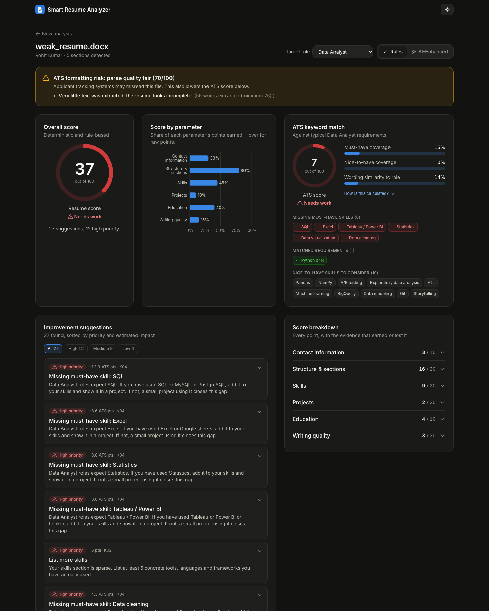
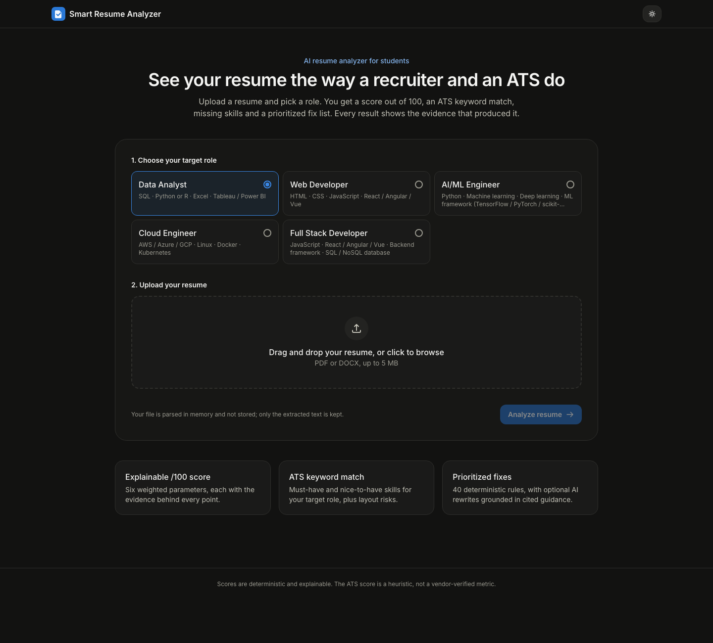
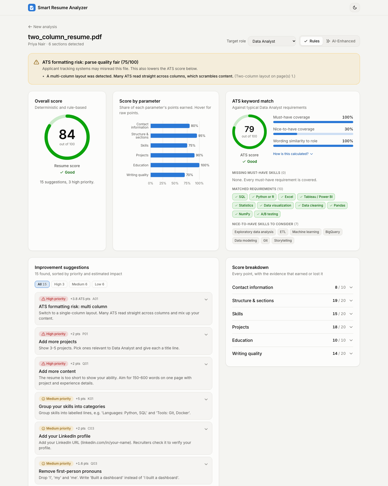
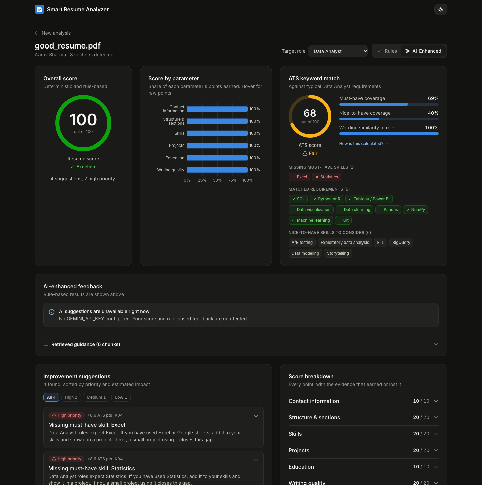
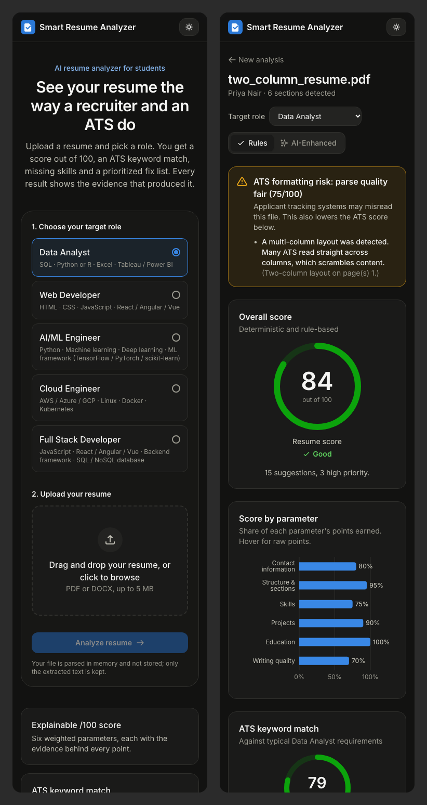
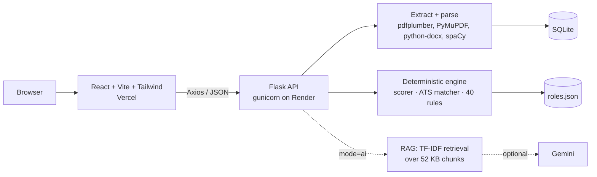

# Smart Resume Analyzer with AI-Based Feedback

Upload a resume (PDF or DOCX), pick a target role, and get:

- a **score out of 100** from six weighted parameters, with the evidence behind every point;
- an **ATS keyword-match score** with matched and missing must-have and nice-to-have skills;
- **layout risk detection** (scanned files, two-column layouts, tables);
- **prioritized, evidence-backed suggestions** from a 40-rule engine;
- an optional **AI-enhanced mode**: bullet rewrites and skill-gap explanations generated by Gemini
  from a retrieved knowledge base, with citations.

The scoring, ATS matching and feedback are **deterministic and rule-based**: the same resume and
role always produce the same result, and no LLM is involved. The AI layer is optional and the app
works fully without an API key.



| Upload | Light theme | AI mode (no key: graceful fallback) | Mobile |
|---|---|---|---|
|  |  |  |  |

## Contents

- [Architecture](#architecture)
- [Quick start](#quick-start)
- [Testing and evaluation](#testing-and-evaluation)
- [API](#api)
- [Deployment](#deployment)
- [Design decisions](#design-decisions)
- [Limitations and future work](#limitations-and-future-work)
- Detailed docs: [AI logic](docs/ai_logic.md) · [Architecture](docs/architecture.md) ·
  [API](docs/api.md) · [Evaluation](docs/evaluation.md) · [Deployment](docs/deployment.md) ·
  [Report outline](docs/report_outline.md) · [Presentation outline](docs/ppt_outline.md)

## Architecture



| Layer | Technology |
|---|---|
| Frontend | React 18, Vite 5, Tailwind CSS 4, Recharts 3, Axios, React Router, react-dropzone |
| Backend | Python 3.11, Flask 3, flask-cors, gunicorn, SQLite (`sqlite3`) |
| NLP | spaCy `en_core_web_sm` (PhraseMatcher, lemmas, NER), NLTK (Porter stemmer), scikit-learn (TF-IDF) |
| Parsing | pdfplumber, PyMuPDF, python-docx |
| AI layer | google-genai (Gemini), NumPy vector store |

How each score is computed is explained in [docs/ai_logic.md](docs/ai_logic.md).

## Quick start

Prerequisites: Python 3.11+, Node.js 18+.

### Backend

```bash
cd backend
python3.11 -m venv venv
source venv/bin/activate            # Windows: venv\Scripts\activate
pip install -r requirements.txt
python -m spacy download en_core_web_sm
cp .env.example .env                # optional: add GEMINI_API_KEY for AI mode
python run.py                       # http://localhost:5000/api/health
```

On macOS, port 5000 may be taken by AirPlay Receiver. If so, run `PORT=5001 python run.py` and set
`VITE_API_BASE_URL=http://localhost:5001` in the frontend.

### Frontend

```bash
cd frontend
npm install
cp .env.example .env                # VITE_API_BASE_URL=http://localhost:5000
npm run dev                         # http://localhost:5173
```

### Try it

Upload any file from `backend/evaluation/samples/`, for example `E06_fresher_average.docx` (a
fair resume) or `E05_fullstack_two_column.pdf` (a layout risk). Switch the target role and the
Rules / AI-Enhanced toggle on the dashboard.

## Testing and evaluation

```bash
cd backend
./venv/bin/python -m pytest -q                         # 324 tests
./venv/bin/python -m pytest -q --cov=app               # about 99% line coverage
./venv/bin/python -m evaluation.run_evaluation         # regenerates docs/evaluation.md

cd ../frontend
npm run lint && npm run build
```

Tests use generated fixture resumes (good, weak, two-column, scanned, table, corrupted,
password-protected, over-long) and cover the parser, every scoring parameter, ATS matching, all 40
feedback rules, the RAG layer (with a fake LLM and a stubbed Gemini SDK) and every API error path.

**Evaluation** on 12 labelled resumes (bands assigned before scoring):

| Pearson r | Spearman rho | MAE vs band midpoint | Band accuracy | Within one band |
|---|---|---|---|---|
| 0.955 | 0.966 | 9.8 | 67% | 100% |

See [docs/evaluation.md](docs/evaluation.md) for the per-resume table, the calibration fix it led to,
and the limitations of a small self-labelled set.

## API

| Method | Endpoint | Description |
|---|---|---|
| GET | `/api/health` | Liveness check |
| POST | `/api/resumes` | Upload (multipart `file`, PDF/DOCX, max 5 MB) -> `{resume_id, filename, parse_quality, sections_detected}` |
| GET | `/api/resumes/<id>` | Parsed text, sections, contact details, parse quality |
| GET | `/api/roles` | Target roles with their requirements |
| GET | `/api/resumes/<id>/analysis?role=<role_id>&mode=rules\|ai` | Score, ATS, suggestions (+ AI feedback in `ai` mode) |

Errors always look like `{"error": "<code>", "message": "<text>"}` with a matching status (400,
404, 413, 415, 422, 500). Full reference with examples: [docs/api.md](docs/api.md).

## Deployment

- **Backend:** Render Blueprint (`render.yaml`) running gunicorn with a health check on
  `/api/health`. A `Procfile` is included for manual setups.
- **Frontend:** Vercel with root directory `frontend` (`frontend/vercel.json` adds SPA rewrites).
- Set `CORS_ORIGINS` on the backend to the Vercel URL, and `VITE_API_BASE_URL` on Vercel to the
  Render URL. `GEMINI_API_KEY` is optional.

Step-by-step guide and the full environment variable table: [docs/deployment.md](docs/deployment.md).

## Design decisions

- **Deterministic core, optional AI.** Scores must be reproducible and explainable, so the LLM never
  touches scoring. It only adds rewrites, after the rule-based analysis is complete.
- **Grounded generation.** The LLM may only use retrieved knowledge-base chunks and must cite them.
  Items citing anything else, or adding numbers not in the original bullet, are discarded.
- **Evidence everywhere.** Every score check, ATS match and suggestion returns the text or
  measurement that produced it.
- **Content vs readability.** The resume score judges content; layout problems lower the ATS score
  and raise a visible warning instead.
- **One place for tunables.** All weights, thresholds and word lists are in `backend/app/config.py`,
  which asserts that each parameter's checks add up to its weight.
- **Privacy.** Uploaded files are parsed in memory and never written to disk; only extracted text is
  stored. There is no login by design.
- **The ATS score is a heuristic, not a vendor-verified metric.** Real applicant tracking systems
  are configured differently by each employer.

## Limitations and future work

- The evaluation set is small, synthetic and labelled by the project team; independent labels on
  real, anonymised resumes are the most valuable next step.
- English only. Scanned resumes are detected but not OCR'd.
- Roles and skills are a hand-written catalogue of five roles; uploading a job description to build
  a custom role would generalise it.
- On Render's free plan SQLite storage is ephemeral; a persistent disk or managed database would be
  needed for history.
- Future: OCR, more roles, job-description matching, exportable PDF report, learned weights once
  enough labelled data exists.

## Project structure

```
resume-analyzer/
  backend/
    app/            Flask app: routes/, services/, data/ (roles.json, kb/), config.py
    evaluation/     labelled dataset, runner, generated sample files
    tests/          pytest suite and fixture builders
    requirements.txt, run.py, Procfile, gunicorn.conf.py, .env.example
  frontend/         React + Vite + Tailwind app (src/pages, src/components, src/api)
  docs/             architecture, AI logic, API, evaluation, deployment, outlines, screenshots
  render.yaml
```
