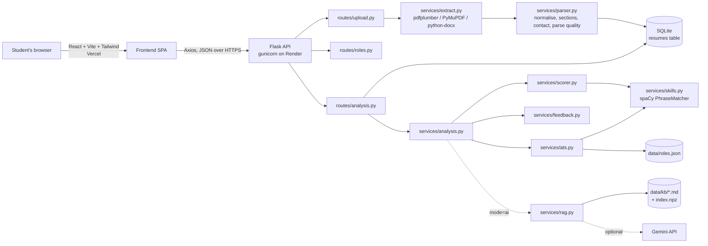
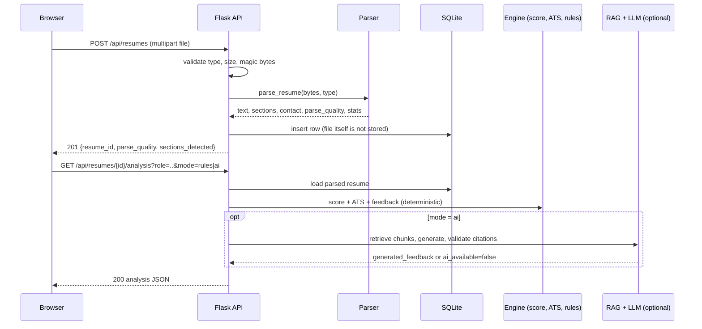

# Architecture

## System overview



Solid arrows are the deterministic path, which always runs. Dotted arrows are the optional AI
layer, which runs only in `mode=ai` and degrades to `ai_available: false` on any failure.

## Request flow



## Backend layout

```
backend/
  app/
    __init__.py        app factory: CORS, JSON errors, blueprints, DB init
    config.py          every weight, threshold, limit and word list
    db.py              sqlite3 persistence (one table)
    errors.py          ApiError + JSON error handlers
    routes/            upload.py (POST/GET resumes), roles.py, analysis.py
    services/
      extract.py       PDF/DOCX text extraction, two-column detection
      parser.py        normalisation, sections, contact, parse quality
      nlp.py           shared spaCy pipeline
      roles.py         roles.json loader + validation
      skills.py        skill matcher (PhraseMatcher + regex)
      resume_features.py  verbs, entries, metrics, pronouns, dates
      scorer.py        /100 rubric
      ats.py           ATS keyword match + TF-IDF
      feedback.py      40-rule engine
      analysis.py      orchestration + AI fallback
      kb.py, rag.py, llm.py   optional RAG layer
    data/              roles.json, kb/ (chunks + index.npz)
  evaluation/          labelled evaluation set + runner
  tests/               pytest suite (unit + API)
```

## Data model

One SQLite table, `resumes`:

| Column | Content |
|---|---|
| id | integer primary key, exposed as `resume_id` |
| filename, file_type | sanitised name, `pdf` or `docx` |
| raw_text | text exactly as extracted |
| clean_text | normalised text used for analysis |
| sections, contact, parse_quality, stats | JSON produced by the parser |
| created_at | timestamp |

Analysis results are not stored: they are recomputed on request, which keeps them consistent with
the current rules and costs about 100 ms.

## Design decisions

| Decision | Why |
|---|---|
| Rule-based, deterministic core | Grading requires the same input to give the same score, and every point must be explainable. |
| LLM only in an optional layer, after scoring | The app must work with no API key; generated text can never change a score. |
| Citation and number validation of LLM output | Prevents ungrounded advice and invented metrics. |
| Uploaded files are not stored | Privacy; only extracted text is needed. |
| `sqlite3` instead of an ORM | One table, no migrations; fewer dependencies. |
| TF-IDF embeddings + NumPy store | 52 chunks need no vector database; works offline and ships in an 11 KB file. |
| All tunables in `config.py` | Weights can be calibrated in one place; `config.py` asserts each parameter's checks sum to its weight. |
| Layout risk lowers the ATS score, not the resume score | Separates "is the content good" from "can a machine read it". |
